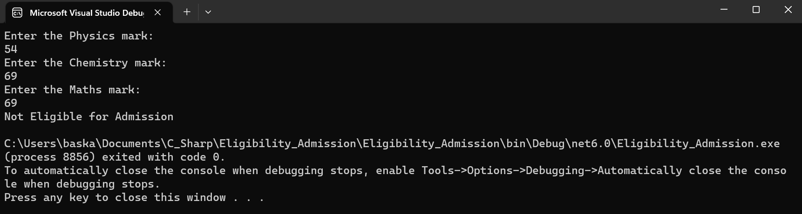

# Eligibility for Admission

## AIM:
To write C# program to find the eligibility for admission to an engineering course.

## ALGORITHM:
Step 1: Create a new class called Admission.

Step 2: Create variables of respective data types to store marks and name.

Step 3: Calculate the total and store it.

Step 4: The conditions for admission are:
Marks in maths >= 65 & Marks in physics >=55 & Marks in chemistry >=50 & Total marks in all three subjects >= 180 or total in maths and physics >= 140.

Step 5: Use Nested if to check whether someone is eligible for admission or not.

Step 6: Print the status of the program.

Step 7: End of program.

## PROGRAM:
```
using System;
namespace Hello
{
    class Scope
    {
        static void Main(string[] args)
        {
            int p,c,m,total,totalmp;
            Console.WriteLine("Enter the Physics mark:");
            p = Convert.ToInt32(Console.ReadLine());
            Console.WriteLine("Enter the Chemistry mark:");
            c = Convert.ToInt32(Console.ReadLine());
            Console.WriteLine("Enter the Maths mark:");
            m = Convert.ToInt32(Console.ReadLine());
            total = p + m + c;
            totalmp = m + p;
            if (p >= 55 && m >= 65 && c >= 50)
            {
                if (total >= 180 || totalmp >= 140)
                {
                    Console.WriteLine("Eligible for Admission");
                }
            }
            else
            {
                Console.WriteLine("Not Eligible for Admission");
            }
        }
    }
}
```

## OUTPUT:




## RESULT:
A C# program is written to find the eligibility for admission to an engineering course and has been successfully executed.
